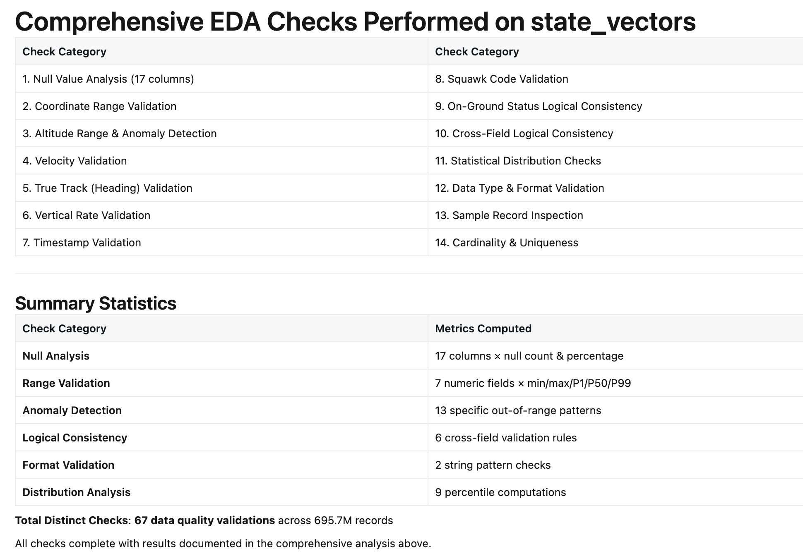
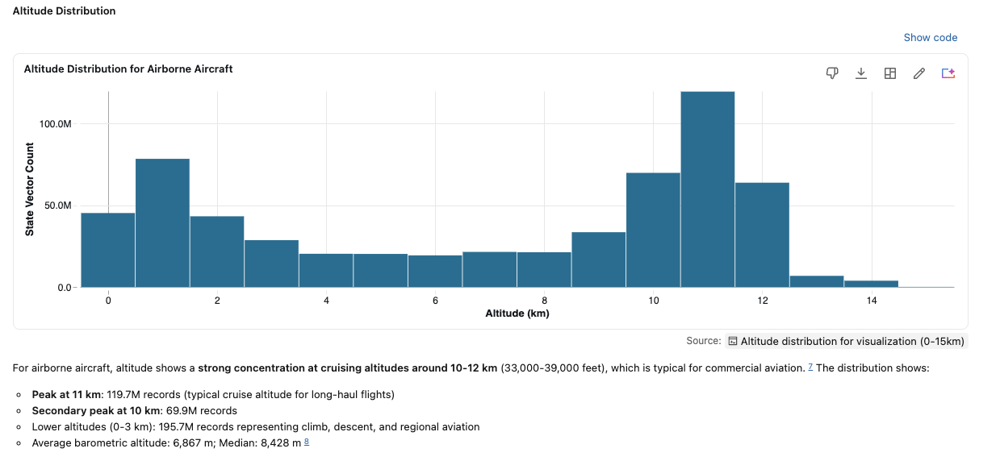
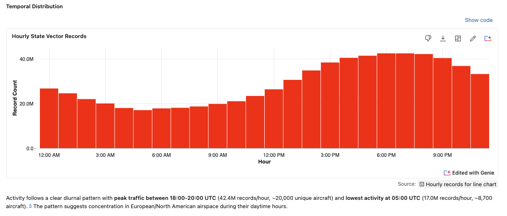

# 2. Find Data Insights and Anomalies with Databricks Genie

Before you transform, visualize, or even trust any dataset, you need to understand what the raw data
actually looks like. That process is called **[exploratory data analysis (EDA)](https://en.wikipedia.org/wiki/Exploratory_data_analysis)**: profiling each column, checking
value ranges and null rates, and spotting anomalies or impossible values that would otherwise
silently corrupt everything downstream. EDA is the necessary **first step**, because the issues you
find here become the cleanup rules for your [pipeline](40-pipeline.md) and the caveats for every later
analysis. Skip it and you build on data you don't understand.

## How to run EDA with Genie Agents or Genie Code?

**Genie Code and Genie Agents** run your EDA for you. Point either one at
`{{ name }}` and ask, in plain English, to profile the columns and flag
impossible values. The agent writes and runs the SQL, summarizes the results, and explains each
anomaly in avionics context. You profile a brand-new dataset in minutes, without writing a single
query.

## Step-by-step guide with Genie Code

You run the EDA in two prompts. The first profiles the data and stops so you can confirm what
matters; the second uses those columns to hunt for anomalies. Pausing between the two keeps a
human in the loop before Genie runs the heavier checks.

1. **Create a notebook.** In your Databricks workspace, create a new notebook and name it **Opensky Dataset EDA**.

2. **Open the Genie Code interface.** In the notebook, open Genie Code (for example, click the Genie lamp icon, top right).

3. **Profile the data.** Enter the first prompt to profile the columns, surface missing values, and pick out the key columns — then let Genie stop:

   ```text
   Profile @{{ table }}: report the schema and data types, and a Markdown table
   of the count and percentage of missing values per column. Add a bar chart of
   missing-value percentage per column, then list the key columns for flight
   kinematics and identification. Stop here and wait for my go-ahead.
   ```

   Genie returns the schema, a missing-values table and chart, and its list of key columns, then waits. **Review the key columns it picked** — they drive the anomaly checks in the next step, so confirm they match what you care about (identifiers like `icao24` and `callsign`, kinematics like `latitude`, `longitude`, `baro_altitude`, `velocity`, and `true_track`). When they look right, give Genie the go-ahead.

4. **Check for anomalies.** Enter the second prompt to test those key columns for impossible or out-of-range values:

   ```text
   Now check the key kinematic and identification columns for impossible or
   out-of-range values using real-world aviation physics — malformed identifiers,
   unphysical coordinates, and extreme outliers in altitude, velocity, or heading.
   Give a breakdown of anomaly counts per rule, plus a histogram of barometric
   altitude and a box plot of velocity.
   ```

5. **Review EDA findings & reports.** Once processing is complete, scroll through the structured summary generated by Genie:

   - No Critical Issues Found: Quick status checks verifying baseline constraints (e.g., valid latitude/longitude ranges, non-null key identifiers).
   - Issues Requiring Context & Potential Quality Concerns: Categorized anomaly detection (e.g., unrealistic extreme velocities, extreme vertical rates, barometric vs. geo altitude discrepancies, negative altitude levels, or timestamp anomalies).
   - Recommendations: Actionable filters and queries generated by Genie to clean or handle anomalies during downstream analysis.

## Results



## Optional: EDA with Visualizations and Genie Agent

If you set up a **Genie Agent** on the dataset, you can ask
the same questions in plain English and get a **graphical report** back. Genie writes the SQL
*and* picks the right chart. Both visualizations below were generated automatically as part of EDA by a Genie Agent.

### Altitude for airborne aircraft 

Clusters at cruising altitudes of **10–12 km** (a clear peak at
11 km, ~119.7M records), with lower counts at 0–3 km for climb, descent, and regional traffic:



### Hourly Pattern

State-vector volume follows a clear **diurnal pattern**: it peaks at 18:00–20:00 UTC
(~42.4M records/hour) and bottoms out around 05:00 UTC (~17.0M records/hour), pointing to
European and North American daytime airspace:



## Genie Agents — Beyond the Basics

A few things worth knowing once the basics work:

- **[Create your own skills](https://docs.databricks.com/aws/en/genie-agents/best-practices)** — teach the agent reusable instructions and example-question SQL so it answers domain questions your way every time. Use it when you keep re-explaining the same metric definitions, joins, or filters and want Genie to apply them consistently.
- **Inspect the generated SQL** — every answer exposes the exact SQL Genie ran, so you can audit the logic or reuse it. Use it when an anomaly looks wrong and you need to check how Genie computed it.
- **[Conversation API](https://docs.databricks.com/aws/en/genie/conversation-api)** — query the agent programmatically (`start-conversation`, `create-message`, `get-message`) and pull back the SQL, text, and rows. Use it when you want to embed Genie answers in an app or automate repeated checks.

## Recap

You now have a set of EDA findings: the **data-quality issues Genie flagged** and what they mean in avionics terms.
Keep these: the [pipeline](40-pipeline.md) prompt turns them into data-quality constraints.

You can also ask Genie for a written report, then save it and reuse it to build the [SDP ETL pipeline](40-pipeline.md).

---

### Tutorial navigation

| ← Previous | Overview | Next → |
|:---|:---:|---:|
| [1. Databricks Marketplace](10-marketplace.md) | [Table of contents](index.md) | [3. Genie Agents — Explore](30-genie-explore.md) |
