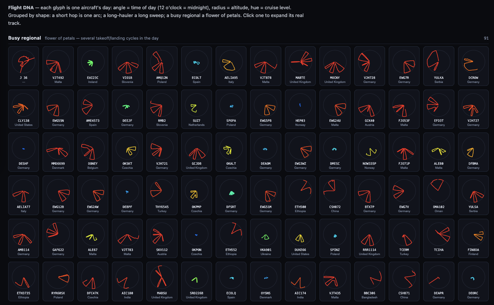
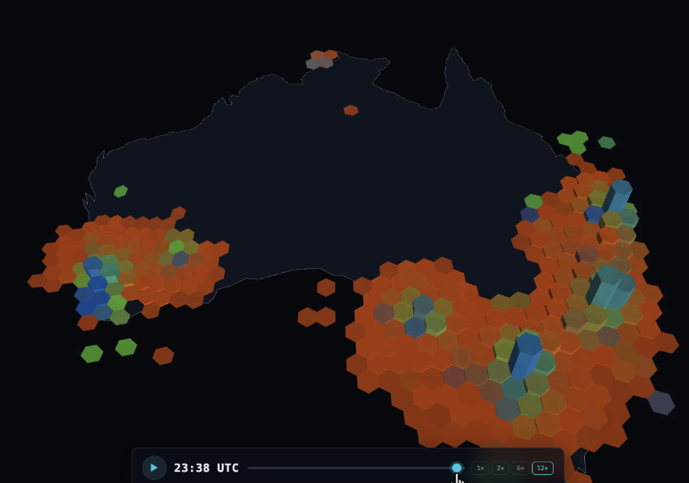

# Bonus — Databricks Apps gallery (Flight DNA)

## Lakebase

> _Full walkthrough coming soon._ This section builds on the **`opensky-online-store`** online store
> from [Step 7](70-ml-models.md) — the serverless Postgres layer that serves the `aircraft_features`
> feature table for low-latency lookups, which a Databricks App can read from directly.

## Databricks Apps

## What you'll do

You build an interactive **Databricks App**: a governed web app hosted right next to your data, with no separate infrastructure to run. It reads from Unity Catalog through a SQL warehouse, runs on serverless compute, and is available on [Databricks Free Edition](https://docs.databricks.com/getting-started/free-edition-limitations) (up to three apps, each running for 24 hours before it stops).

You build the app on top of a **gold table** from the [Spark Declarative Pipeline](40-pipeline.md). This is the common pattern: Databricks Apps sit on the gold tables an SDP pipeline produces, so it reads cleaned, query-ready data instead of raw records. If you only want to try the app quickly, you can point it at the raw table for a proof of concept, but that shortcut is not meant for anything more serious.

You describe the app you want in plain English and a coding agent writes, builds, and deploys it. Any coding agent works here: **Claude Code**, **Codex**, or Databricks **Genie Code** inside the workspace. Coding-agent support for Databricks Apps keeps improving across recent releases, so expect the in-workspace path to get smoother over time.

## What Databricks Apps can you build on the OpenSky data?

Coding agents such as **Claude Code**, **Codex**, and Databricks **Genie Code** turn a plain-English prompt into full visualizations and applications. Our Solutions Architects have used this OpenSky dataset for several proofs of concept. Each one below runs as a [Databricks App](https://www.databricks.com/blog/announcing-general-availability-databricks-apps): hosted next to the data, with governed access and no separate infrastructure. One plots Flight DNA, one an [H3](https://docs.databricks.com/aws/en/sql/language-manual/sql-ref-h3-geospatial-functions) flight-density map of Australia, and one the holding patterns over Sydney Airport.



*Flight DNA: each glyph is one aircraft's day. The angle is time of day (12 o'clock is midnight), the radius is altitude, and the hue is cruise level. A short hop is one arc, a long-hauler a long sweep, and a busy regional a flower of petals. Runs as a Databricks App.*



*H3 flight-density map of Australia: flights binned into H3 hexagons, extruded and colored by density, with a time scrubber to play the day forward. Runs as a Databricks App.*


*Holding patterns over Sydney Airport. The tight loops are aircraft circling as they wait to land. Runs as a Databricks App.*

## Step-by-step guide

> **Step 1: Create the Databricks App**
>
> In your workspace, create a new **Databricks App** named `opensky-flights`. On Free Edition you can run up to three at once.
>
> **Step 2: Generate and deploy it from a prompt**
>
> Open **Genie Code** in the app and describe what you want in plain English: name the dataset (your pipeline's gold table, or `serverless_stable_bbecx8_catalog.opensky.state_vectors_raw` for a quick proof of concept), say how the data should load, list the views and how to navigate between them, then ask it to build and deploy.

### Ready-to-use prompt — the "Flight DNA" app

The first visualization above (one radial glyph per aircraft) is reproducible from a single prompt.
Paste this into **Genie Code** / Genie App Builder (or any coding agent — Claude Code, Codex) to build, smoke-test, and
deploy it end to end:

```text
Build, smoke-test, and deploy a Databricks App named opensky-flight-dna.
Use serverless_stable_bbecx8_catalog.opensky.state_vectors_raw to create a responsive, dark-themed "Flight DNA" visualization:
- Add a SQL warehouse as an app resource.
- Query it with the Databricks SQL Connector, authenticated as the app's service principal.
- Identify the 120 busiest aircraft by state-vector count where baro_altitude IS NOT NULL.
- Retrieve their full-day tracks using icao24, callsign, time_position, baro_altitude, latitude, and longitude.
- Keep the app responsive by filtering early, limiting total rows, and downsampling tracks when necessary.
Display each aircraft as a radial glyph:
- Angle: UTC time of day, with midnight at the top and time moving clockwise.
- Radius: barometric altitude normalized across the selected dataset.
- Color: altitude band—orange for low, yellow for medium, and green/blue for high.
- Connect points chronologically to form each aircraft's daily flight pattern.
Render the glyphs in a responsive grid using inline SVG or Plotly, labeled by callsign. When a user
selects a glyph, expand it to show the aircraft's latitude/longitude route on an interactive map.
Handle loading, empty states, and query errors gracefully. Follow the repository's existing app
structure and deployment conventions.
```

> [!TIP]
> This points at `serverless_stable_bbecx8_catalog.opensky.state_vectors_raw` — the raw working copy
> in your writable catalog — for a quick proof of concept. For a production app, swap it for one of
> your pipeline's gold tables (`gold_americas` / `gold_emea` / `gold_apac`) so the app reads cleaned,
> query-ready data instead of raw records.

## Going further with Databricks Apps

A few things worth knowing once the basics work:

- **Workspace-aware discovery:** generated [Databricks App](https://docs.databricks.com/dev-tools/databricks-apps/) code resolves fully-qualified Unity Catalog names and warehouse IDs from your workspace, so the app runs without hand-editing table paths or resource IDs.
- **Pre-wired warehouse and endpoints:** name the SQL warehouse or serving endpoint once and the generated code binds to it, so the app gets governed, consistent access.
- **Smoke test before deploy:** a generated smoke test exercises the app's data path and UI before you ship, so you get early confirmation it works end to end.
- **Serverless micro apps:** the prompt-to-app flow is maturing into [*governed vibe coding*](https://www.databricks.com/blog/enabling-governed-vibe-coding-enterprise-apps-databricks) that respect your data governance by default. They run as **serverless micro apps** (scale-to-zero VMs, pay only for use), so even small internal tools are worth shipping. 


## Recap

You have a live, governed **Databricks App**: built on a gold table from your SDP pipeline, deployed from a plain-English prompt, and running next to your data on serverless compute.

---

### Tutorial navigation

| ← Previous | Overview | Next → |
|:---|:---:|---:|
| [9. Databricks Apps + ML + Lakebase](90-lakebase-apps.md) | [Table of contents](index.md) | [10. Open Sharing](100-opensharing.md) |
